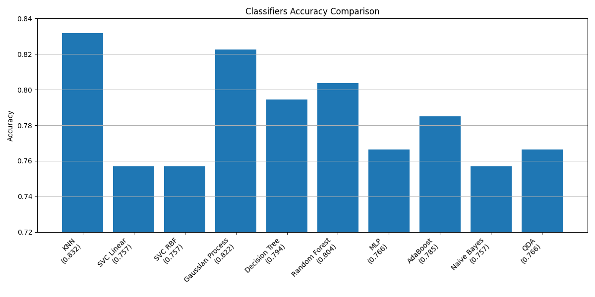

# Titanic Classification with scikit-learn

A simple machine learning project using [scikit-learn](https://scikit-learn.org/stable/) to predict Titanic survival based on passenger data such as age, gender, and class. See the [dataset folder](../Titanic_dataset/) for more information.  

## Steps
1. First, I tested all models in a [single notebook](train%20all.ipynb) to identify the best-performing ones.  
   
2. I then optimized the top five models, experimenting with multiple hyperparameters in the [optimize models folder](optimize%20models/) and saving the plots for each in the [results folder](results/).
3. Finally, I used the two best models to make predictions on the Titanic data. The Kaggle result for [Gaussian Process](predict%20Gaussian%20Process.ipynb) was `0.77`, and for [KNeighbors](predict%20KNeighbors.ipynb) it was `0.73`.