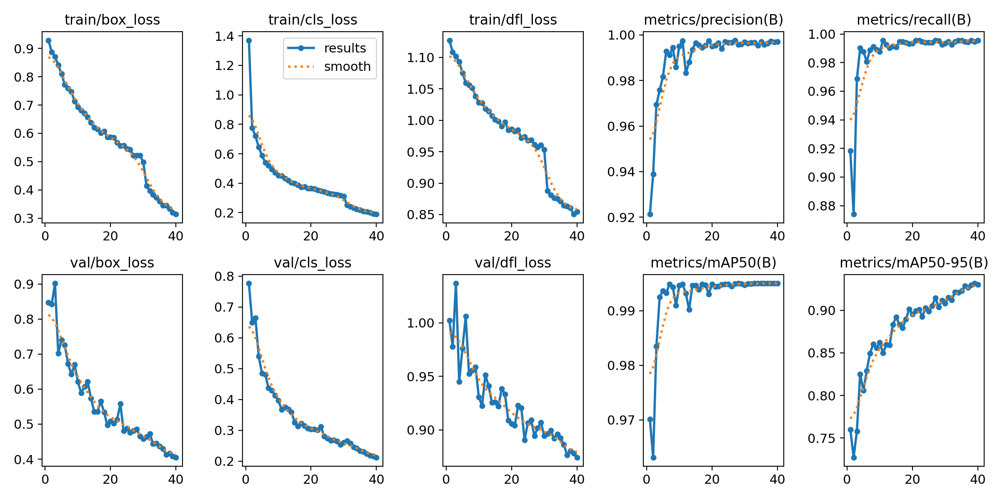
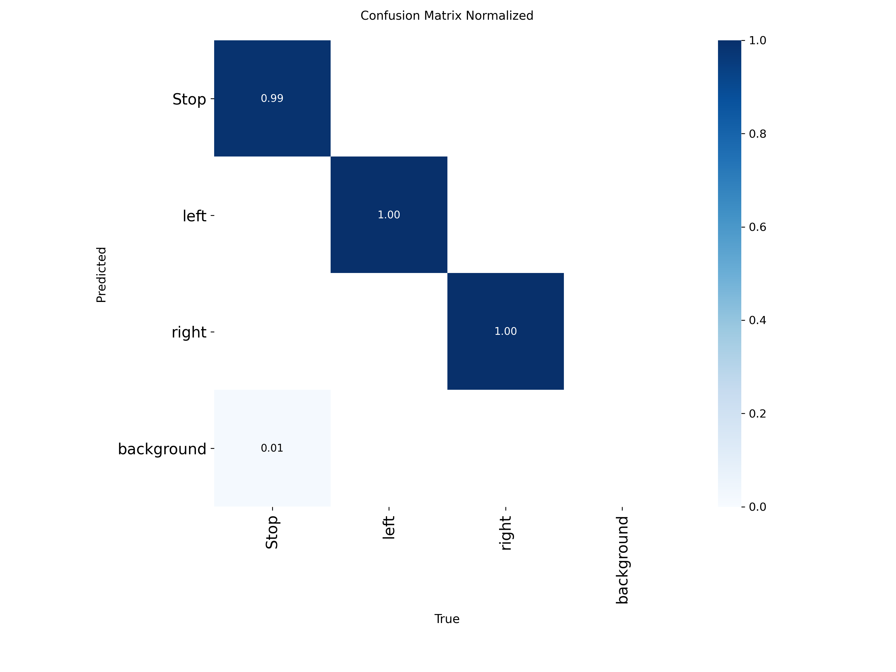
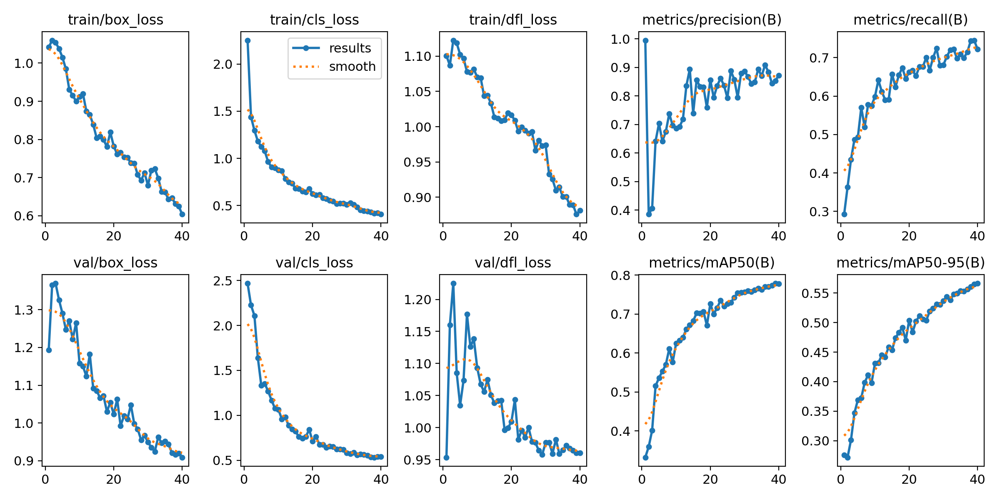
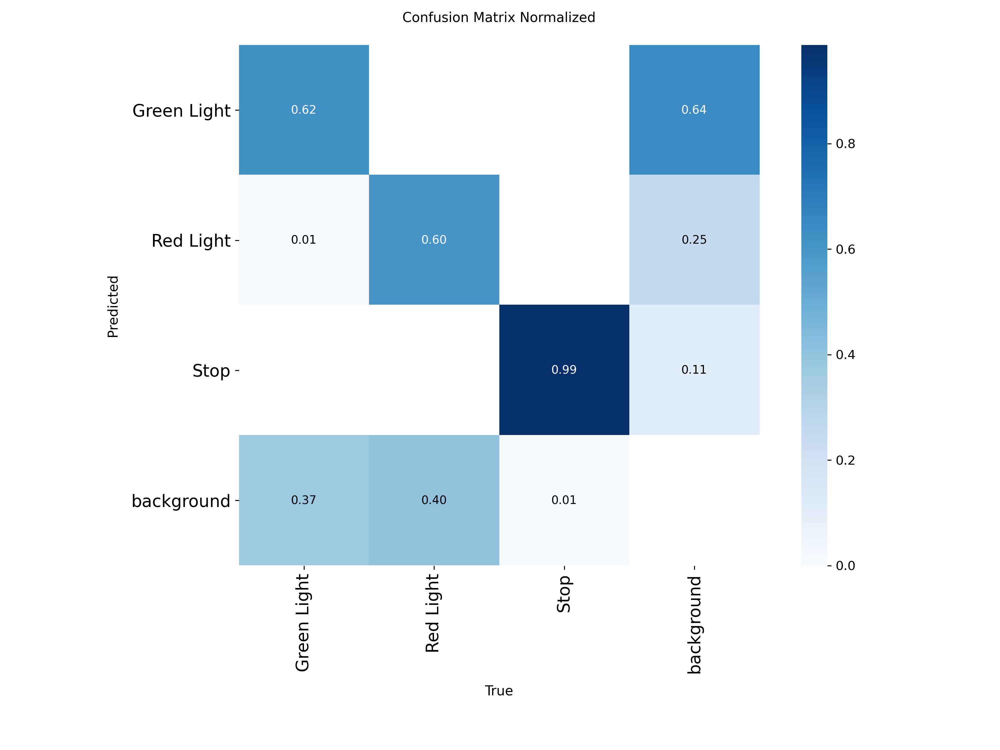

# Machine Learning Basics with Ultralytics YOLOv8

This was my first encounter with machine learning, using [Ultralytics YOLOv8](https://docs.ultralytics.com/models/yolov8/) to detect objects in images and then train the model on custom datasets. I also learned how to use [Jupyter notebooks](train.ipynb) with Python and terminal commands.

## Datasets
Two datasets with traffic signs were downloaded from [Kaggle](https://www.kaggle.com/) and prepared for YOLO using [Roboflow](https://app.roboflow.com/).

## Results
The results for training, validation, and prediction are saved in the [/runs/detect/](./runs/detect/) folder.  
For each dataset, separate plots of the training process and the corresponding confusion matrices are provided:

  
  
  
